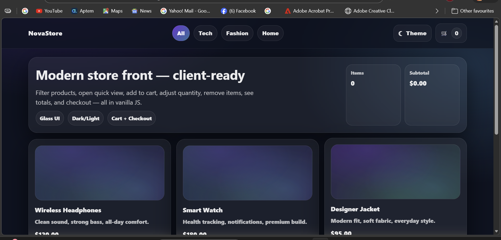

# 🛒 NovaStore — Mini E-Commerce Pro

A premium, client-ready mini e-commerce front-end built using pure **HTML, CSS, and Vanilla JavaScript**.

Includes cart sidebar, quantity control, remove items, total calculations, checkout view, dark/light mode, and modern glass UI.

---

## 🌍 Live Demo

🔗 **Demo:**  
https://fredeeex.github.io/mini-ecommerce/

---

## 📸 Preview

  

---

## ✨ Features

- Responsive layout (mobile-first)
- Modern Glassmorphism UI
- Dark / Light theme toggle (saved in LocalStorage)
- Product filtering (All / Tech / Fashion / Home)
- Quick View Modal
- Add to Cart
- Cart Sidebar Drawer
- Quantity Increase / Decrease
- Remove Items
- Automatic Total Calculation
- Shipping + Tax calculation (demo logic)
- Checkout View with Form Validation
- LocalStorage cart persistence
- Scroll progress indicator

---

## 🛠 Tech Stack

- HTML5
- CSS3 (Flexbox + Grid + Glass UI)
- Vanilla JavaScript (ES6)
- LocalStorage API

---

## 📂 Project Structure
